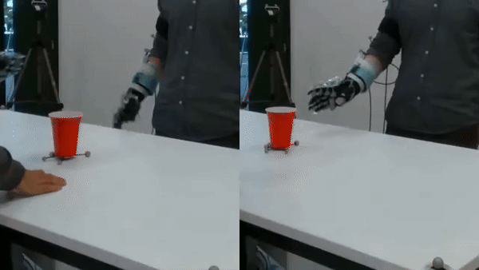

# Is the Human Being Careful or Not?

Robot Controller that classifies human manipulation of objects as either careful or not careful and reacts appropriately. 

## Classifying object manipulation as Careful or Not Careful from human motion. 
We present two approaches for careful dectection: Acceleration Method & Deceleration Method. The differences are explained in the paper. 

SDK:
- Simulation Data on MATLAB
- Real Experiments on Python & ROS

TODO:
- [ ] add instructions
- [ ] add setup
- [ ] add part on ROS
- [ ] add more info on the two approaches

# Table of Contents

- [Dependencies](#dependencies)
- [Instructions](#instructions)
- [Setup](#setup)
- [Citation](#citation)
- [Contributing](#contributing)
- [License](#license)

## Dependencies
- Khansari/SEDS/SEDS_lib [link](https://bitbucket.org/khansari/seds/src/master/) 
- Khansari/SEDS/GMR_lib

## Citation 
If you find this code useful in your research, please consider citing the [Journal](https://ieeexplore.ieee.org/abstract/document/9951394) paper:

	@ARTICLE{9951394,
	  author={Duarte, Nuno F. and Billard, Aude and Santos-Victor, José},
	  journal={IEEE Transactions on Cognitive and Developmental Systems}, 
	  title={The Role of Object Physical Properties in Human Handover Actions: Applications in Robotics}, 
	  year={2022},
	  volume={},
	  number={},
	  pages={1-1},
	  doi={10.1109/TCDS.2022.3222088}
	  }

or the [Conference](https://ieeexplore.ieee.org/abstract/document/9278084) paper:

	@INPROCEEDINGS{9278084,
	  author={Duarte, Nuno Ferreira and Chatzilygeroudis, Konstantinos and Santos-Victor, José and Billard, Aude},
	  booktitle={2020 Joint IEEE 10th International Conference on Development and Learning and Epigenetic Robotics (ICDL-EpiRob)}, 
	  title={From human action understanding to robot action execution: how the physical properties of handled objects modulate non-verbal cues}, 
	  year={2020},
	  volume={},
	  number={},
	  pages={1-6},
	  doi={10.1109/ICDL-EpiRob48136.2020.9278084}
	  }

## Contributing

Nuno Ferreira Duarte

## License

MIT © Nuno Duarte
